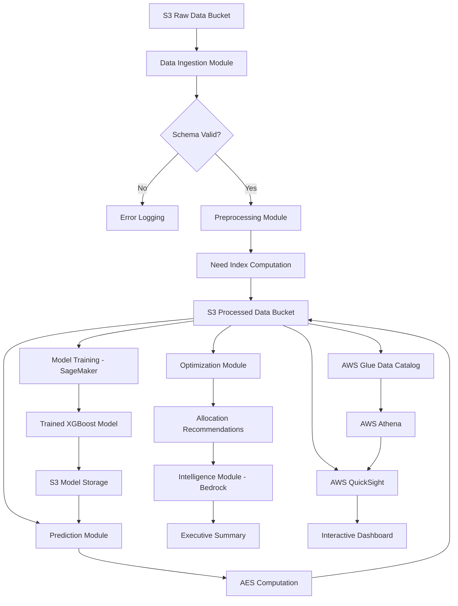

# Design Document: DISHA Governance Engine

## Overview

DISHA (Data Intelligence for Smart Handling of Allocation) is an AWS-based cloud governance engine that uses machine learning and optimization to detect and correct public resource misallocation across districts. The system operates as a batch processing pipeline with five distinct layers:

1. **Data Layer**: Ingestion, validation, and storage using S3, Glue, and Athena
2. **AI Layer**: Predictive modeling using SageMaker with XGBoost
3. **Optimization Layer**: Budget-constrained allocation optimization
4. **Intelligence Layer**: Executive summary generation using AWS Bedrock
5. **Presentation Layer**: Interactive dashboards using AWS QuickSight

The system processes district-level socioeconomic indicators through a multi-stage pipeline: data ingestion → preprocessing and feature engineering → predictive modeling → optimization → intelligence generation → visualization. Each stage is independently testable and can be executed on-demand for new budget cycles.

## Architecture

### High-Level Architecture



### AWS Service Architecture

**Storage and Data Management:**
- **S3 Buckets**: Three buckets for raw data, processed data, and model artifacts
- **AWS Glue**: Data catalog for schema management and metadata
- **AWS Athena**: SQL query engine for ad-hoc analysis

**Compute and ML:**
- **AWS SageMaker**: Model training and hosting for XGBoost regression
- **AWS Lambda** (optional): Orchestration of pipeline stages
- **AWS Step Functions** (optional): Workflow coordination

**Intelligence and Visualization:**
- **AWS Bedrock**: LLM-based executive summary generation
- **AWS QuickSight**: Dashboard and visualization

**Configuration and Monitoring:**
- **S3 Configuration File**: JSON-based system configuration
- **CloudWatch Logs**: Centralized logging for all modules

### Data Flow

1. **Ingestion**: CSV files uploaded to S3 raw bucket trigger processing
2. **Validation**: Schema and data quality checks
3. **Preprocessing**: Feature engineering, normalization, Need Index computation
4. **Storage**: Processed data written to S3 in Parquet format, cataloged in Glue
5. **Training**: Historical data used to train XGBoost model in SageMaker
6. **Prediction**: Current period data scored using trained model
7. **Scoring**: AES computed and districts classified
8. **Optimization**: Budget-constrained allocation computed
9. **Intelligence**: Executive summary generated via Bedrock
10. **Visualization**: QuickSight dashboard refreshed with latest data

## Components and Interfaces

### 1. Data Ingestion Module

**Responsibility**: Load and validate raw district data from S3

**Inputs:**
- S3 path to raw CSV file
- Expected schema definition

**Outputs:**
- Validated DataFrame with required columns
- Validation error report (if validation fails)

**Key Functions:**
```python
def load_raw_data(s3_path: str) -> pd.DataFrame
def validate_schema(df: pd.DataFrame, required_columns: List[str]) -> ValidationResult
def check_duplicates(df: pd.DataFrame, key_columns: List[str]) -> List[Tuple]
def validate_numeric_ranges(df: pd.DataFrame, range_specs: Dict) -> ValidationResult
```

**Validation Rules:**
- Required columns: District_ID, District_Name, Population, Population_Density, Historical_Allocation, Complaint_Count, Infrastructure_Index, Poverty_Rate, Literacy_Rate, Period
- No duplicate (District_ID, Period) combinations
- Infrastructure_Index, Poverty_Rate, Literacy_Rate ∈ [0, 1]
- Population, Population_Density, Historical_Allocation, Complaint_Count ≥ 0

### 2. Preprocessing Module

**Responsibility**: Clean data, engineer features, compute Need Index and AES

**Inputs:**
- Validated DataFrame from ingestion
- Configuration (NI weights, AES thresholds)
- Predicted allocations (for AES computation)

**Outputs:**
- Processed DataFrame with engineered features
- Parquet file written to S3 processed bucket
- Glue catalog registration

**Key Functions:**
```python
def normalize_feature(series: pd.Series) -> pd.Series
def compute_complaint_rate(complaints: pd.Series, population: pd.Series) -> pd.Series
def compute_infrastructure_deficit(infrastructure_index: pd.Series) -> pd.Series
def compute_need_index(df: pd.DataFrame, weights: Dict[str, float]) -> pd.Series
def compute_aes(current_allocation: pd.Series, predicted_need: pd.Series) -> pd.Series
def classify_districts(aes: pd.Series, under_threshold: float, over_threshold: float) -> pd.Series
def write_to_s3_parquet(df: pd.DataFrame, s3_path: str, partition_cols: List[str]) -> None
def register_with_glue(s3_path: str, table_name: str, schema: Dict) -> None
```

**Need Index Formula:**
```
NI = (w1 × Population_Density_Normalized) + 
     (w2 × Complaint_Rate_Normalized) + 
     (w3 × Poverty_Rate) + 
     (w4 × Infrastructure_Deficit_Score)

where:
- Population_Density_Normalized = (PD - PD_min) / (PD_max - PD_min)
- Complaint_Rate = (Complaint_Count / Population) × 100,000
- Complaint_Rate_Normalized = (CR - CR_min) / (CR_max - CR_min)
- Infrastructure_Deficit_Score = 1 - Infrastructure_Index
- w1 + w2 + w3 + w4 = 1.0
```

**AES Formula:**
```
AES = Current_Allocation / Predicted_Need

Classification:
- Under_Allocated: AES < 0.9
- Over_Allocated: AES > 1.1
- Balanced: 0.9 ≤ AES ≤ 1.1
```

### 3. Prediction Module

**Responsibility**: Train XGBoost model and generate allocation predictions

**Inputs:**
- Processed DataFrame with features
- Model hyperparameters from configuration
- Training mode flag (train vs predict)

**Outputs:**
- Trained model serialized to S3 (training mode)
- Predicted allocations (prediction mode)
- Model evaluation metrics (RMSE, MAPE)

**Key Functions:**
```python
def prepare_features(df: pd.DataFrame) -> Tuple[np.ndarray, np.ndarray]
def train_xgboost_model(X_train: np.ndarray, y_train: np.ndarray, hyperparams: Dict) -> xgb.Booster
def evaluate_model(model: xgb.Booster, X_test: np.ndarray, y_test: np.ndarray) -> Dict[str, float]
def save_model_to_s3(model: xgb.Booster, s3_path: str, metadata: Dict) -> None
def load_model_from_s3(s3_path: str) -> xgb.Booster
def predict_allocations(model: xgb.Booster, X: np.ndarray) -> np.ndarray
```

**Feature Set:**
- Population
- Population_Density
- Complaint_Count
- Infrastructure_Index
- Poverty_Rate
- Literacy_Rate
- Need_Index

**Target Variable:**
- Historical_Allocation

**Model Configuration:**
- Algorithm: XGBoost Regression
- Train/Test Split: 80/20
- Evaluation Metrics: RMSE (Root Mean Squared Error), MAPE (Mean Absolute Percentage Error)
- Hyperparameters: learning_rate, max_depth, n_estimators, subsample (configurable)

**SageMaker Integration:**
```python
# Training job configuration
estimator = sagemaker.estimator.Estimator(
    image_uri=xgboost_container,
    role=sagemaker_role,
    instance_count=1,
    instance_type='ml.m5.xlarge',
    hyperparameters={
        'objective': 'reg:squarederror',
        'num_round': 100,
        'max_depth': 6,
        'eta': 0.3
    }
)
```

### 4. Optimization Module

**Responsibility**: Compute optimal allocation under budget constraints

**Inputs:**
- Current allocations per district
- Predicted needs per district
- Total budget constraint

**Outputs:**
- Recommended allocations per district
- Percentage change from current allocation
- Optimization status (converged/failed)

**Key Functions:**
```python
def optimize_allocation(current: np.ndarray, predicted: np.ndarray, total_budget: float) -> OptimizationResult
def compute_percentage_change(current: np.ndarray, recommended: np.ndarray) -> np.ndarray
def validate_budget_constraint(allocations: np.ndarray, budget: float, tolerance: float) -> bool
```

**Optimization Formulation:**

Minimize:
```
Σ(i=1 to n) (recommended_i - predicted_i)²
```

Subject to:
```
Σ(i=1 to n) recommended_i = total_budget
recommended_i ≥ 0 for all i
```

**Implementation Approach:**
- Use scipy.optimize.minimize with SLSQP method
- Constraints: equality constraint for budget sum, bounds for non-negativity
- Initial guess: current allocations (if they sum to budget) or proportional scaling

```python
from scipy.optimize import minimize

def objective(x, predicted):
    return np.sum((x - predicted) ** 2)

def budget_constraint(x, total_budget):
    return np.sum(x) - total_budget

constraints = [
    {'type': 'eq', 'fun': budget_constraint, 'args': (total_budget,)}
]
bounds = [(0, None) for _ in range(n_districts)]

result = minimize(
    objective,
    x0=initial_guess,
    args=(predicted_needs,),
    method='SLSQP',
    bounds=bounds,
    constraints=constraints
)
```

### 5. Intelligence Module

**Responsibility**: Generate executive summaries using AWS Bedrock

**Inputs:**
- District classification results (under/over/balanced counts)
- Top under-allocated districts with deficit amounts
- Top over-allocated districts with excess amounts
- Optimization recommendations

**Outputs:**
- Executive summary text (≤500 words)
- Fallback template-based summary (if Bedrock fails)

**Key Functions:**
```python
def prepare_summary_context(df: pd.DataFrame) -> Dict
def generate_bedrock_summary(context: Dict, model_id: str) -> str
def generate_fallback_summary(context: Dict) -> str
def format_currency(amount: float) -> str
```

**Bedrock Prompt Template:**
```
You are a policy advisor analyzing public resource allocation data.

Context:
- Total districts analyzed: {total_districts}
- Under-allocated districts: {under_allocated_count}
- Over-allocated districts: {over_allocated_count}
- Balanced districts: {balanced_count}

Top 3 Under-Allocated Districts:
{under_allocated_details}

Top 3 Over-Allocated Districts:
{over_allocated_details}

Generate an executive summary (max 500 words) that:
1. Highlights the overall allocation pattern
2. Identifies the most critical imbalances
3. Provides 2-3 actionable policy recommendations
4. Uses clear, non-technical language suitable for government executives
```

**Bedrock Configuration:**
- Model: Claude 3 Sonnet or Haiku
- Max tokens: 1000
- Temperature: 0.3 (for consistency)

### 6. Visualization Module

**Responsibility**: Create and refresh QuickSight dashboards

**Inputs:**
- Athena connection to processed data
- Dashboard template configuration

**Outputs:**
- Interactive QuickSight dashboard
- Scheduled refresh configuration

**Dashboard Components:**

1. **Geographic Heatmap**
   - Visual: Map chart
   - Metric: AES by district
   - Color scale: Red (under-allocated) → Yellow (balanced) → Green (over-allocated)

2. **Allocation Comparison Bar Chart**
   - Visual: Grouped bar chart
   - X-axis: District names
   - Y-axis: Allocation amount
   - Series: Current Allocation, Predicted Need

3. **Need Index Distribution**
   - Visual: Histogram
   - X-axis: Need Index bins
   - Y-axis: District count

4. **Allocation Trends**
   - Visual: Line chart
   - X-axis: Period
   - Y-axis: Total allocation
   - Series: Actual, Predicted

5. **Summary KPIs**
   - Total districts
   - Under-allocated count
   - Over-allocated count
   - Average AES

**Filters:**
- Period selector
- District classification (under/over/balanced)
- AES range slider

**Data Freshness Indicator:**
- Display last refresh timestamp
- Warning banner if data > 7 days old

## Data Models

### Raw Data Schema

```python
{
    "District_ID": "string",           # Unique district identifier
    "District_Name": "string",         # Human-readable district name
    "Population": "integer",           # Total population
    "Population_Density": "float",     # People per square km
    "Historical_Allocation": "float",  # Previous allocation in currency units
    "Complaint_Count": "integer",      # Number of complaints filed
    "Infrastructure_Index": "float",   # 0-1 scale, higher = better
    "Poverty_Rate": "float",           # 0-1 scale, proportion in poverty
    "Literacy_Rate": "float",          # 0-1 scale, proportion literate
    "Period": "string"                 # Format: "YYYY-Q#" or "YYYY"
}
```

### Processed Data Schema

Extends raw schema with computed features:

```python
{
    # ... all raw data columns ...
    "Population_Density_Normalized": "float",    # 0-1 normalized
    "Complaint_Rate": "float",                   # Per 100k population
    "Complaint_Rate_Normalized": "float",        # 0-1 normalized
    "Infrastructure_Deficit_Score": "float",     # 1 - Infrastructure_Index
    "Need_Index": "float",                       # Weighted composite score
    "Predicted_Allocation": "float",             # ML model prediction
    "AES": "float",                              # Allocation Efficiency Score
    "Classification": "string",                  # "Under" | "Over" | "Balanced"
    "Processing_Timestamp": "timestamp"          # When record was processed
}
```

### Configuration Schema

```json
{
    "need_index_weights": {
        "w1_population_density": 0.25,
        "w2_complaint_rate": 0.30,
        "w3_poverty_rate": 0.25,
        "w4_infrastructure_deficit": 0.20
    },
    "aes_thresholds": {
        "under_threshold": 0.9,
        "over_threshold": 1.1
    },
    "model_hyperparameters": {
        "learning_rate": 0.1,
        "max_depth": 6,
        "n_estimators": 100,
        "subsample": 0.8
    },
    "model_evaluation": {
        "rmse_warning_threshold": 1000000,
        "performance_degradation_threshold": 0.10
    },
    "s3_paths": {
        "raw_data_bucket": "disha-raw-data",
        "processed_data_bucket": "disha-processed-data",
        "model_bucket": "disha-models",
        "config_bucket": "disha-config"
    },
    "glue_catalog": {
        "database_name": "disha_db",
        "processed_table_name": "district_data_processed"
    }
}
```

### Model Metadata Schema

```python
{
    "model_id": "string",              # Unique model identifier
    "training_date": "timestamp",      # When model was trained
    "training_data_period": "string",  # Period range used for training
    "features": ["list of strings"],   # Feature names used
    "hyperparameters": "dict",         # Model hyperparameters
    "evaluation_metrics": {
        "rmse": "float",
        "mape": "float",
        "r2_score": "float"
    },
    "s3_model_path": "string",         # S3 location of serialized model
    "status": "string"                 # "active" | "archived"
}
```

### Optimization Result Schema

```python
{
    "optimization_id": "string",
    "timestamp": "timestamp",
    "total_budget": "float",
    "convergence_status": "string",    # "converged" | "failed"
    "iterations": "integer",
    "districts": [
        {
            "district_id": "string",
            "current_allocation": "float",
            "predicted_need": "float",
            "recommended_allocation": "float",
            "percentage_change": "float",
            "absolute_change": "float"
        }
    ]
}
```


## Correctness Properties

A property is a characteristic or behavior that should hold true across all valid executions of a system—essentially, a formal statement about what the system should do. Properties serve as the bridge between human-readable specifications and machine-verifiable correctness guarantees.

### Property 1: Schema Validation Correctness

*For any* CSV file structure, the Data_Ingestion_Module should correctly identify whether it contains all required columns (District_ID, District_Name, Population, Population_Density, Historical_Allocation, Complaint_Count, Infrastructure_Index, Poverty_Rate, Literacy_Rate, Period), and only load files with valid schemas.

**Validates: Requirements 1.1, 1.3**

### Property 2: Duplicate Detection

*For any* dataset with District_ID and Period columns, the Data_Ingestion_Module should reject the dataset if and only if there exist duplicate (District_ID, Period) combinations.

**Validates: Requirements 1.5**

### Property 3: Need Index Computation Correctness

*For any* district data with Population_Density, Complaint_Count, Population, Infrastructure_Index, Poverty_Rate, and weights (w1, w2, w3, w4), the computed Need_Index should equal (w1 × Population_Density_Normalized) + (w2 × Complaint_Rate_Normalized) + (w3 × Poverty_Rate) + (w4 × (1 - Infrastructure_Index)), where normalization follows min-max scaling.

**Validates: Requirements 2.1, 2.4**

### Property 4: Normalization Range Invariant

*For any* numeric feature that undergoes min-max normalization, all normalized values should be in the range [0, 1], with the minimum value mapping to 0 and the maximum value mapping to 1.

**Validates: Requirements 2.2, 2.3**

### Property 5: Weight Normalization

*For any* set of weights (w1, w2, w3, w4) that do not sum to 1.0, the Preprocessing_Module should normalize them proportionally such that the normalized weights sum to exactly 1.0 and maintain their relative proportions.

**Validates: Requirements 2.6**

### Property 6: Need Index Persistence

*For any* processed dataset, the output should contain a Need_Index column with computed values for all districts.

**Validates: Requirements 2.7**

### Property 7: Train-Test Split Ratio

*For any* dataset split into training and testing sets, the training set should contain approximately 80% of the data and the testing set should contain approximately 20% (within 1% tolerance for rounding).

**Validates: Requirements 4.4**

### Property 8: Model Serialization Round Trip

*For any* trained XGBoost model, serializing it to S3 and then deserializing it should produce a model that generates identical predictions on the same input data.

**Validates: Requirements 4.7**

### Property 9: Prediction Completeness

*For any* set of N districts with current period data, the Prediction_Module should generate exactly N predictions, one for each district.

**Validates: Requirements 5.1**

### Property 10: Prediction Unit Consistency

*For any* trained model and prediction inputs, the predicted allocations should have the same order of magnitude and statistical distribution as the Historical_Allocation values used during training.

**Validates: Requirements 5.4**

### Property 11: AES Computation Correctness

*For any* Current_Allocation and Predicted_Need values (where Predicted_Need > 0), the computed AES should equal Current_Allocation / Predicted_Need.

**Validates: Requirements 6.1**

### Property 12: AES Classification Correctness

*For any* computed AES value, the district classification should be "Under" if AES < 0.9, "Over" if AES > 1.1, and "Balanced" if 0.9 ≤ AES ≤ 1.1.

**Validates: Requirements 6.3, 6.4, 6.5**

### Property 13: Optimization Budget Constraint

*For any* optimization result with total budget B, the sum of all recommended allocations should equal B (within numerical tolerance of 0.01%), and all individual allocations should be non-negative.

**Validates: Requirements 7.2, 7.3**

### Property 14: Optimization Objective Minimization

*For any* optimization result, the sum of squared deviations between recommended allocations and predicted needs should be less than or equal to the sum of squared deviations for the current allocations (assuming current allocations satisfy the budget constraint).

**Validates: Requirements 7.1**

### Property 15: Percentage Change Calculation

*For any* pair of current and recommended allocations, the computed percentage change should equal ((Recommended - Current) / Current) × 100.

**Validates: Requirements 7.4**

### Property 16: Executive Summary Completeness

*For any* allocation analysis results, the generated executive summary should contain: the count of under-allocated districts, the count of over-allocated districts, identification of top under-allocated districts, and identification of top over-allocated districts.

**Validates: Requirements 8.2**

### Property 17: Summary Length Constraint

*For any* generated executive summary, the word count should not exceed 500 words.

**Validates: Requirements 8.4**

### Property 18: Dashboard Data Staleness Detection

*For any* dashboard with data timestamp T and current time C, if C - T > 7 days, then a staleness warning should be displayed.

**Validates: Requirements 9.7**

### Property 19: Period Isolation

*For any* reprocessing operation on data for Period P, the processed data for all other periods should remain unchanged.

**Validates: Requirements 11.1**

### Property 20: Processing Idempotence

*For any* input dataset, processing it multiple times should produce identical output datasets (same values, same structure).

**Validates: Requirements 11.2**

### Property 21: Error Logging Format

*For any* error that occurs in any module, the logged error should contain the module name, a timestamp, and a descriptive message.

**Validates: Requirements 12.1**

### Property 22: Input Validation Range Checking

*For any* input data, values for Infrastructure_Index, Poverty_Rate, and Literacy_Rate should be validated to be in range [0, 1], and numeric columns (Population, Population_Density, Historical_Allocation, Complaint_Count) should be validated to be non-negative.

**Validates: Requirements 12.2, 12.3**

### Property 23: Batch Error Reporting

*For any* dataset with multiple validation errors, all errors should be collected and reported together in a single error report, not one at a time.

**Validates: Requirements 12.4**

### Property 24: Feature Presence Validation

*For any* prediction request, if any required feature is missing from the input data, the Prediction_Module should return an error before attempting prediction.

**Validates: Requirements 12.5**

### Property 25: Configuration Round Trip

*For any* valid configuration JSON file, loading it from S3 and parsing it should produce a configuration object that, when serialized back to JSON, matches the original file structure and values.

**Validates: Requirements 13.1**

### Property 26: Scenario Data Isolation

*For any* scenario testing run, processing scenario data should not modify or affect any production data stored in the production S3 buckets.

**Validates: Requirements 15.2**

### Property 27: Scenario Output Labeling

*For any* scenario testing run with scenario identifier ID, all output records should contain a field with value ID.

**Validates: Requirements 15.4**

## Error Handling

### Error Categories

1. **Data Validation Errors**
   - Invalid schema (missing required columns)
   - Duplicate records (District_ID, Period combinations)
   - Out-of-range values (rates not in [0,1], negative counts)
   - Invalid data types (non-numeric values in numeric columns)

2. **Processing Errors**
   - Division by zero in AES calculation (Predicted_Need = 0)
   - Normalization failures (all values identical, cannot compute min-max)
   - Model training failures (insufficient data, convergence issues)
   - Optimization failures (infeasible constraints, non-convergence)

3. **Integration Errors**
   - S3 access failures (permissions, bucket not found)
   - Bedrock API failures (rate limits, service unavailable)
   - SageMaker failures (training job errors, endpoint unavailable)
   - Athena query failures (syntax errors, timeout)

4. **Configuration Errors**
   - Missing configuration file
   - Invalid JSON format
   - Missing required configuration keys
   - Invalid configuration values (negative weights, invalid thresholds)

### Error Handling Strategies

**Validation Errors:**
- Collect all validation errors before reporting (batch reporting)
- Provide specific error messages with row numbers and column names
- Halt processing and require data correction
- Log errors to CloudWatch with ERROR level

**Processing Errors:**
- Log warnings for recoverable issues (e.g., negative predictions clipped to zero)
- Halt processing for unrecoverable issues (e.g., division by zero)
- Provide diagnostic information (e.g., which districts have invalid data)
- Support manual intervention and reprocessing

**Integration Errors:**
- Implement retry logic with exponential backoff for transient failures
- Provide fallback mechanisms (e.g., template-based summaries if Bedrock fails)
- Log integration errors with full context (API response, request parameters)
- Alert operators for persistent integration failures

**Configuration Errors:**
- Use documented default values if configuration is missing
- Validate configuration on load and reject invalid configurations
- Log active configuration at start of each run
- Provide clear error messages for configuration issues

### Error Recovery

**Automatic Recovery:**
- Retry transient failures (S3 access, API calls) up to 3 times
- Use fallback mechanisms (template summaries, default configurations)
- Clip invalid predictions to valid ranges (negative → 0)
- Normalize invalid weights automatically

**Manual Recovery:**
- Provide clear error messages with actionable guidance
- Support reprocessing from any pipeline stage
- Maintain audit logs for debugging
- Enable rollback to previous model versions

### Logging Strategy

All errors logged to CloudWatch with structured format:
```json
{
    "timestamp": "ISO-8601 timestamp",
    "level": "ERROR | WARNING | INFO",
    "module": "module_name",
    "error_type": "validation | processing | integration | configuration",
    "message": "Human-readable error description",
    "context": {
        "district_id": "optional context",
        "period": "optional context",
        "file_path": "optional context"
    },
    "stack_trace": "optional stack trace for exceptions"
}
```

## Testing Strategy

### Dual Testing Approach

The DISHA system requires both unit testing and property-based testing for comprehensive validation:

**Unit Tests** focus on:
- Specific examples with known correct outputs
- Edge cases (empty datasets, single district, extreme values)
- Error conditions (invalid inputs, missing data, API failures)
- Integration points (S3 operations, Glue catalog, Bedrock calls)
- Configuration loading and validation

**Property-Based Tests** focus on:
- Universal properties that hold for all valid inputs
- Mathematical correctness (formulas, calculations, constraints)
- Data transformations (normalization, aggregation)
- Invariants (budget constraints, range constraints)
- Idempotence and reproducibility

Both approaches are complementary and necessary. Unit tests catch specific bugs and validate concrete scenarios, while property tests verify general correctness across a wide input space.

### Property-Based Testing Configuration

**Framework Selection:**
- **Python**: Use Hypothesis library
- **Test Configuration**: Minimum 100 iterations per property test
- **Tagging**: Each property test must reference its design document property

**Tag Format:**
```python
# Feature: disha-governance-engine, Property 1: Schema Validation Correctness
@given(csv_structure=csv_structures())
def test_schema_validation_correctness(csv_structure):
    # Test implementation
```

**Generator Strategies:**

For district data:
```python
from hypothesis import given, strategies as st

@st.composite
def district_data(draw):
    return {
        'District_ID': draw(st.text(min_size=1, max_size=10)),
        'District_Name': draw(st.text(min_size=1, max_size=50)),
        'Population': draw(st.integers(min_value=1000, max_value=10000000)),
        'Population_Density': draw(st.floats(min_value=1, max_value=10000)),
        'Historical_Allocation': draw(st.floats(min_value=0, max_value=1e9)),
        'Complaint_Count': draw(st.integers(min_value=0, max_value=100000)),
        'Infrastructure_Index': draw(st.floats(min_value=0, max_value=1)),
        'Poverty_Rate': draw(st.floats(min_value=0, max_value=1)),
        'Literacy_Rate': draw(st.floats(min_value=0, max_value=1)),
        'Period': draw(st.sampled_from(['2023-Q1', '2023-Q2', '2024-Q1']))
    }
```

For weights:
```python
@st.composite
def need_index_weights(draw):
    # Generate 4 positive floats
    raw_weights = [draw(st.floats(min_value=0.01, max_value=1)) for _ in range(4)]
    # Normalize to sum to 1.0
    total = sum(raw_weights)
    return {
        'w1': raw_weights[0] / total,
        'w2': raw_weights[1] / total,
        'w3': raw_weights[2] / total,
        'w4': raw_weights[3] / total
    }
```

### Unit Testing Strategy

**Module-Level Tests:**

1. **Data Ingestion Module**
   - Test valid schema acceptance
   - Test invalid schema rejection with specific error messages
   - Test duplicate detection with known duplicates
   - Test range validation with boundary values
   - Test empty file handling

2. **Preprocessing Module**
   - Test Need Index calculation with known inputs/outputs
   - Test normalization with edge cases (all same values, single value)
   - Test AES calculation with known allocations and needs
   - Test classification with boundary AES values (0.9, 1.1)
   - Test weight normalization with non-normalized weights

3. **Prediction Module**
   - Test model training with small dataset
   - Test prediction generation with trained model
   - Test error handling for missing model
   - Test metric calculation (RMSE, MAPE)
   - Test model serialization and deserialization

4. **Optimization Module**
   - Test optimization with simple 3-district case
   - Test budget constraint satisfaction
   - Test non-negativity constraint
   - Test percentage change calculation
   - Test convergence failure handling

5. **Intelligence Module**
   - Test summary generation with mock Bedrock response
   - Test fallback summary generation
   - Test summary completeness (required elements present)
   - Test word count limit
   - Test Bedrock API failure handling

**Integration Tests:**

1. **End-to-End Pipeline**
   - Test complete pipeline with small dataset (10 districts)
   - Verify data flows through all stages
   - Verify outputs are created in correct S3 locations
   - Verify Glue catalog is updated

2. **AWS Service Integration**
   - Test S3 read/write operations
   - Test Glue catalog registration
   - Test Athena query execution
   - Test Bedrock API calls
   - Test SageMaker training and prediction

3. **Scenario Testing**
   - Test scenario mode data isolation
   - Test scenario output labeling
   - Test scenario vs production separation

### Test Data

**Mock Datasets:**

Create synthetic datasets for testing:
- **Small**: 10 districts, 4 periods (for quick tests)
- **Medium**: 50 districts, 8 periods (for integration tests)
- **Large**: 200 districts, 12 periods (for performance tests)

**Edge Case Datasets:**
- All districts with identical values (tests normalization edge case)
- Single district (tests aggregation edge cases)
- Extreme values (very high/low populations, allocations)
- Missing optional fields
- Boundary values for rates (exactly 0, exactly 1)

**Error Case Datasets:**
- Invalid schema (missing columns, extra columns)
- Duplicate records
- Out-of-range values
- Negative values where not allowed
- Non-numeric values in numeric columns

### Continuous Testing

**Pre-Commit Tests:**
- Run all unit tests
- Run fast property tests (10 iterations)

**CI/CD Pipeline Tests:**
- Run all unit tests
- Run full property tests (100 iterations)
- Run integration tests with mocked AWS services
- Run end-to-end tests with LocalStack

**Production Validation:**
- Monitor model performance metrics
- Track processing success rates
- Alert on validation error spikes
- Compare predictions against actuals (when available)

### Test Coverage Goals

- **Unit Test Coverage**: Minimum 80% code coverage
- **Property Test Coverage**: All 27 correctness properties implemented
- **Integration Test Coverage**: All AWS service interactions tested
- **Error Path Coverage**: All error handling paths tested

### Testing Tools

- **Unit Testing**: pytest
- **Property-Based Testing**: Hypothesis
- **Mocking**: pytest-mock, moto (for AWS services)
- **Coverage**: pytest-cov
- **Integration Testing**: LocalStack (local AWS simulation)
- **Performance Testing**: pytest-benchmark
